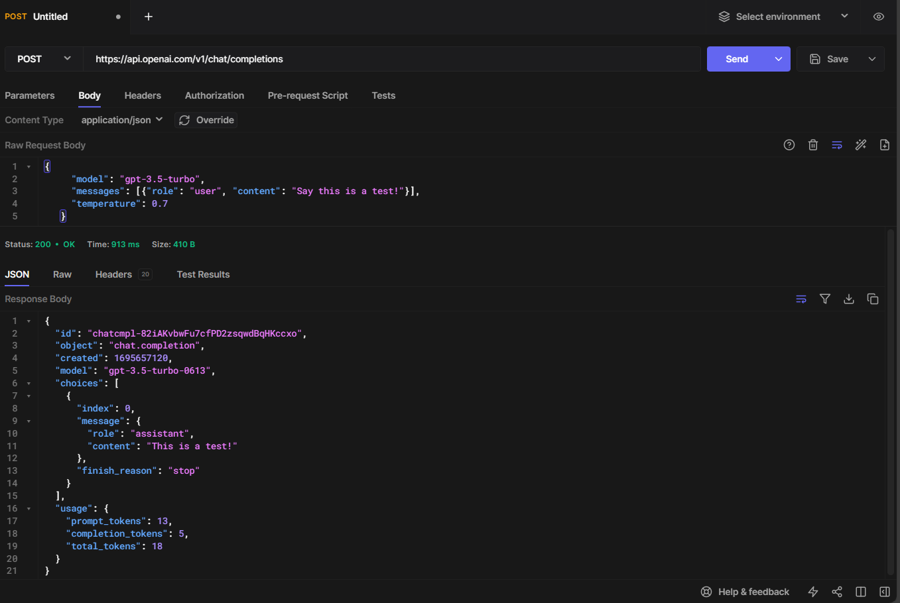
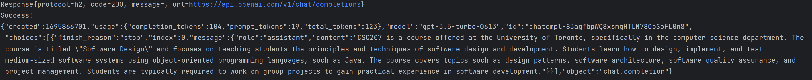
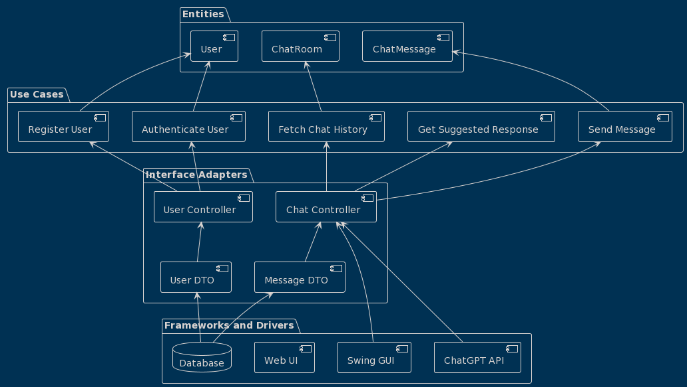

# 207-Project
Project domain: Chatting app  
Description:
- A chatting or messaging app for friends and meeting new people
  - Send and receive messages
  - Search through chat history
- Users can use the ChatGPT API to help with replying to the conversation if they are stuck and don't know what to say
- Require users to make an account
- Have lifetime statistics on number of messages sent, average length of message, etc.

API documentation: https://platform.openai.com/docs/api-reference  
API test:     
Called with Java:   

## GPTChatHelper with Spring Boot and Websocket

## What is Websocket?
>  WebSocket is a computer communications protocol, providing full-duplex communication channels over a single TCP connection.
>  WebSocket is distinct from HTTP. The protocol enables interaction between a web browser (or other client application) and a web server with lower overhead than half-duplex alternatives such as HTTP polling, facilitating real-time data transfer from and to the server.

Once a websocket connection is established between a client and a server, both can exchange information until the connection is closed by any of the parties.

This is the main reasion which websocket is preferred over the HTTP protocol when building a chat-like communication service that operates at high frequencies with low latency.

## What is STOMP?
>  Simple (or Streaming) Text Oriented Message Protocol (STOMP), formerly known as TTMP, is a simple text-based protocol, designed for working with message-oriented middleware (MOM). It provides an interoperable wire format that allows STOMP clients to talk with any message broker supporting the protocol.

Since websocket is just a communication protocol, it doesn’t know how to send a message to a particular user. STOMP is basically a messaging protocol which is useful for these functionalities.

## What is Clean Architecture?

Clean Architecture is a software design philosophy that separates the concerns of software applications into layers. It allows for the decoupling of how the system works from the rules and use cases of the system. This decoupling provides several benefits such as:

- Independent development of different layers.
- Independent testing, meaning business rules can be tested without UI or database.
- Improved maintainability.

In our chat application, we're integrating the principles of Clean Architecture to ensure scalability, maintainability, and testability.

## System Components According to Clean Architecture

### 1. Entities
- **User**: Represents the user in the system.
- **ChatMessage**: Represents the individual messages exchanged in a chat room.
- **ChatRoom**: Represents a chat room or a channel where multiple users can communicate.

### 2. Use Cases
- **Register User**: The action of a user signing up.
- **Authenticate User**: Verifying the user's identity.
- **Send Message**: Sending a chat message.
- **Fetch Chat History**: Retrieving past messages from a chat room.
- **Get Suggested Response**: A feature that provides suggested replies using the ChatGPT API.

### 3. Interface Adapters
- **User Controller**: Handles user-related operations.
- **Chat Controller**: Manages chat functionalities.
- **User DAO**: Data Access Object for user data.
- **Message DAO**: Data Access Object for chat messages.

### 4. Frameworks and Drivers
- **Database**: Stores user data, chat messages, and chat room information.
- **ChatGPT API**: Provides AI-based suggested responses.
- **Web UI**: The browser-based interface for users.
- **Swing GUI**: A potential desktop-based user interface.

## Project Structure

- src
  - main
    - java
      - com.gptchathelper
        - entities
          - User.java
          - ChatMessage.java
          - ChatRoom.java
        - usecases
          - RegisterUser.java
          - AuthenticateUser.java
          - JoinChatRoom.java
          - LeaveChatRoom.java
          - SendMessage.java
          - FetchChatHistory.java
          - GetSuggestedResponse.java
        - adapters
          - UserController.java
          - ChatController.java
          - UserDAO.java
          - MessageDAO.java
        - framework
          - WebSocketConfig.java
          - DatabaseConfig.java
          - ChatGPTAPI.java
    - resources
      - static
        - css
          - main.css
        - js
          - main.js
        - views
          - chat.html
          - login.html
      - application.properties

## Enhanced Features

- **ChatGPT Integration**: By integrating with the ChatGPT API, our chat application can provide real-time AI-based suggested responses to users.
- **Swing GUI**: Apart from a web-based interface, users can also access the chat application through a desktop application built using Java Swing.

---
Clean Architecture UML:   
## Configuring WebSocket

Configuring our websocket endpoint and message broker is fairly simple.

    @Configuration
    @EnableWebSocketMessageBroker
    public class WebSocketConfig implements WebSocketMessageBrokerConfigurer {
    
        @Override
        public void registerStompEndpoints(StompEndpointRegistry registry) {
            registry.addEndpoint("/websocket").withSockJS();
        }
    
        @Override
        public void configureMessageBroker(MessageBrokerRegistry registry) {
            registry.enableSimpleBroker("/topic");
            registry.setApplicationDestinationPrefixes("/app");
        }
    }

* @EnableWebSocketMessageBroker annotation is used to enable our WebSocket server.

* WebSocketMessageBrokerConfigurer interface is used to provide implementation for some of its methods to configure the websocket connection.

* registerStompEndpoints method is used to register a websocket endpoint that the clients will use to connect to the server.

* configureMessageBroker method is used to configure our message broker which will be used to route messages from one client to another.

SockJS is also being used to enable fallback options for browsers that don’t support websocket.

## Creating a Chat Model

Our chat model is the message payload which will be exchanged between the client side and server side of the application.

    public class ChatMessage {
        private String content;
        private String sender;
        private MessageType type;
    
        public enum MessageType {
            *CHAT*, *LEAVE*, *JOIN
        *}
    
        public String getContent() {
            return content;
        }
    
        public void setContent(String content) {
            this.content = content;
        }
    
        public String getSender() {
            return sender;
        }
    
        public void setSender(String sender) {
            this.sender = sender;
        }
    
        public MessageType getType() {
            return type;
        }
    
        public void setType(MessageType type) {
            this.type = type;
        }
    }

## Creating our Chat Controller

Our controller will be responsible for handling all message methods present in our chat application which will basically receive messages from one client and then broadcast it to others.

    @Controller
    public class ChatController {
    
        @MessageMapping("/chat.register")
        @SendTo("/topic/public")
        public ChatMessage register(@Payload ChatMessage chatMessage, SimpMessageHeaderAccessor headerAccessor) {
            headerAccessor.getSessionAttributes().put("username", chatMessage.getSender());
            return chatMessage;
        }
    
        @MessageMapping("/chat.send")
        @SendTo("/topic/public")
        public ChatMessage sendMessage(@Payload ChatMessage chatMessage) {
            return chatMessage;
        }
    }

The use of /app as a destination point is because of our websocket configuration file which says that all messages will be routed to these handling methods annotated with @MessageMapping.

## Creating a front-end UI

Our UI is a simple cardbox built using HTML and CSS that runs some JS functions to send and receive messages.

* index.html is a HTML file which contains some basic structure a S*ock.js* to enable fallback options to those that can’t run JS on their browsers and a *STOMP* library to serve as a message broker.
* main.css is a CSS file that styles our HTML.
* main.js is a Javascript file which connects the websocket endpoint to send and receive messages. It also displays and format the messages on the screen.